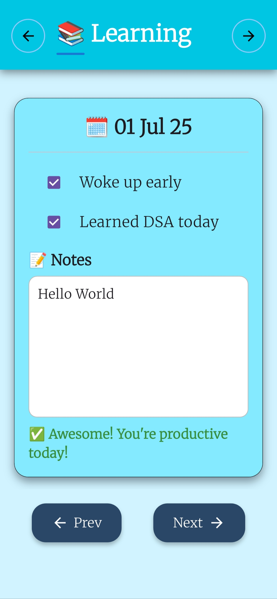
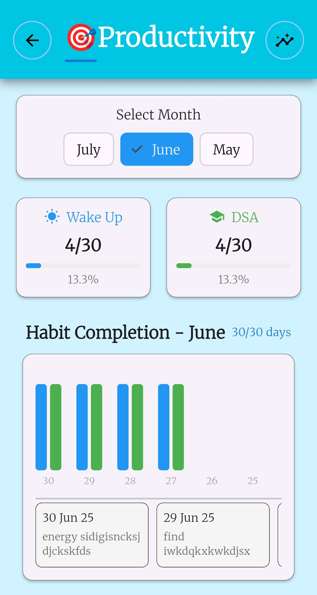
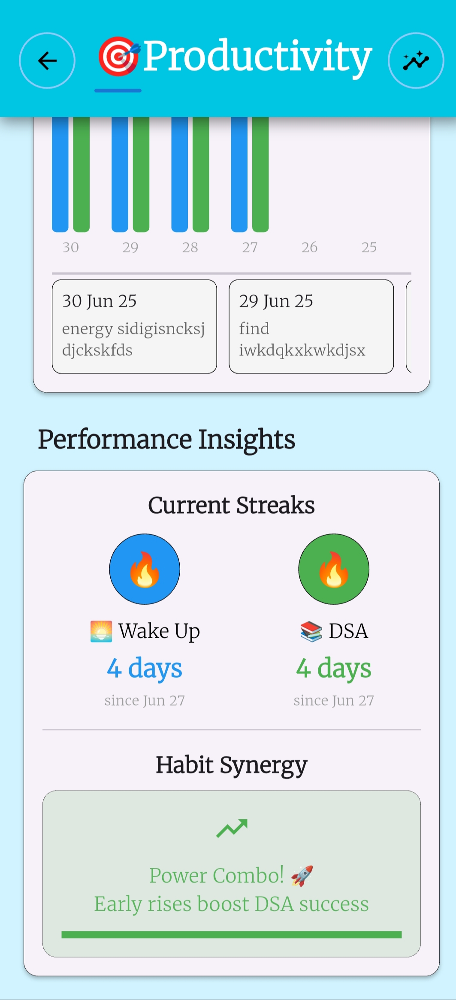
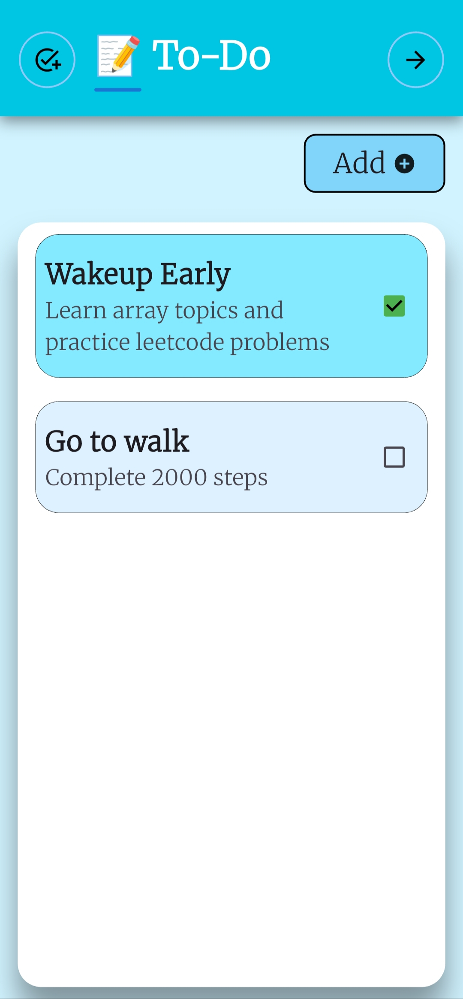

# 📝 TrackStack

**TrackStack** is a Flutter-based productivity app that helps you manage your daily goals and learning habits using a clean, card-based interface. Each day has its own card where you can log whether you woke up early, learned DSA, and write personal notes. All data is stored locally using SharedPreferences and persists even after restarting the app.

---

## 🚀 Features

- 🗓️ Track your daily productivity (Woke Up Early, Learned DSA, Notes)
- 🧠 Swipe between days with a beautiful card swiper
- 💾 Local data persistence with SharedPreferences
- 📝 Automatically saves every change in real-time
- 📅 Pre-loads 5 daily cards for initial use
- 🎨 Clean, responsive UI with custom gradients and shadows

---

## 📸 Screenshots


<p align="center">

|  |  |
|:------------------------------------------------:|:-----------------------------------------:|
|                **Splash Screen**                 |             **Learning Page**             |

|  |  |
|:-------------------------------------:|:-------------------------------------:|
|             **Product 1**             |             **Product 2**             |


**ToDo Page**
</p>


---

## 🛠️ Technologies Used

- **Flutter** – Framework
- **Dart** – Programming Language
- **SharedPreferences** – Local data storage
- **flutter_card_swiper** – Swipable card UI
- **intl** – Date formatting

---

## 🗂️ Project Structure

lib/<br>
├── main.dart<br>
├── pages/<br>
│ ├── daily_pages.dart<br>
│ └── task_model.dart<br>
assets/<br>
└── screenshots/<br>
├── todo_page.png<br>
├── learning_1.png<br>
└── learning_2.png<br>

### ▶️ Getting Started

1. **Clone this repository**
   ```bash
   git clone https://github.com/your-username/TrackStack.git
   cd TrackStack

2. **Install Dependencies**
   ```bash
   flutter pub get


3. **Run the app**
   ```bash
   flutter run

# 📄 License
This project is licensed under the MIT License.
Feel free to fork it and make it your own!

### ✨ Made with Flutter by Pritam Thopate

---

